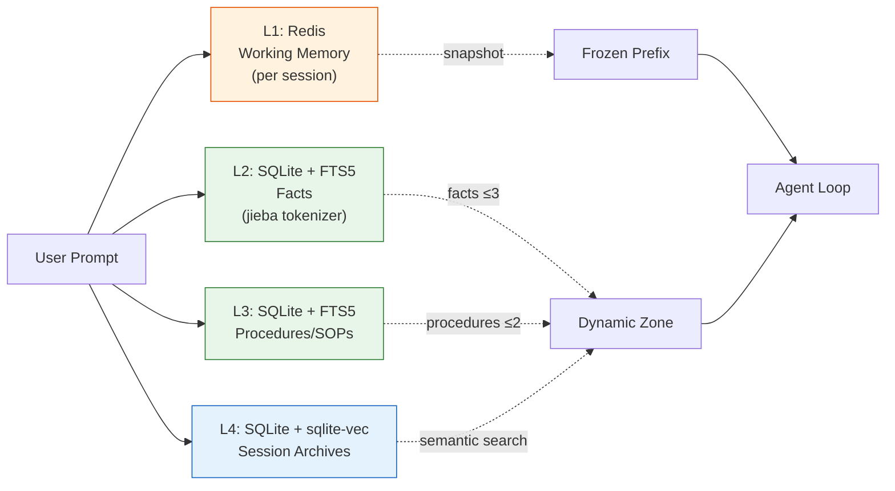
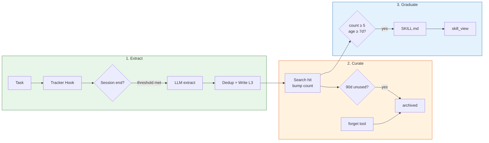
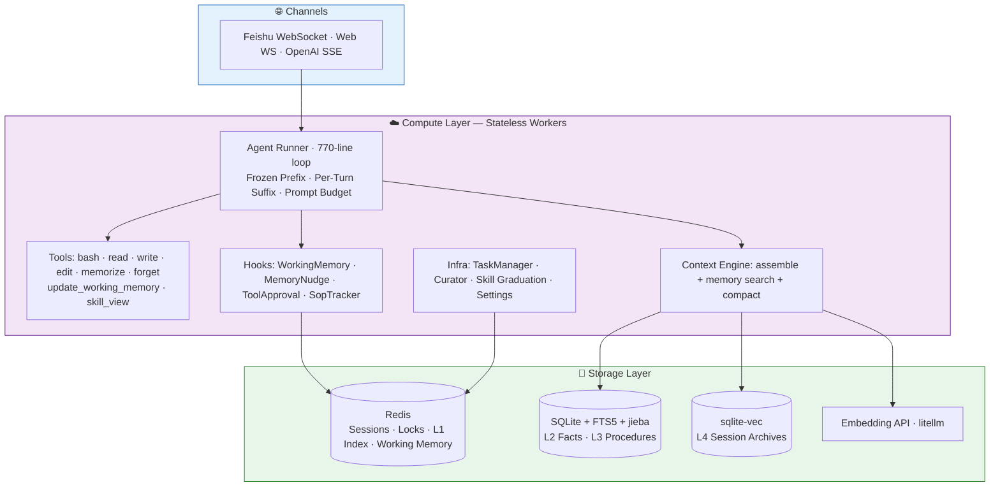
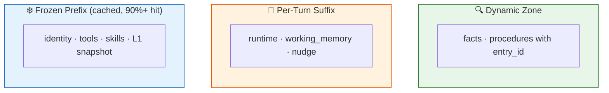

<div align="center">

# 🐍 PyClaw

**A production-grade Python AI Agent framework with persistent memory, hooks-driven architecture, and compute-storage separation.**

[English](./README.md) · [中文文档](./README_CN.md) · [📚 WeChat: Time留痕 公众号合集 →](https://mp.weixin.qq.com/mp/appmsgalbum?__biz=MzY5ODI5NzUwNA==&action=getalbum&album_id=4503553062812516353)

[](./LICENSE)
[](https://www.python.org/)
[]()
[]()
[]()
[]()
[]()

</div>

<br clear="all"/>


---

## ✨ Why PyClaw?

OpenClaw is a powerful multi-channel AI assistant — but its TypeScript monolith (17,000+ files) tightly couples compute and storage, and lacks production-grade memory. PyClaw rebuilds it from scratch in Python with a **memory-first, hooks-driven, horizontally scalable** architecture:

- 🧠 **4-Layer Memory System** — L1 Redis hot index → L2 facts → L3 procedures → L4 vector archives. Production-ready, fully integrated into the agent loop.
- 🔄 **Self-Evolution** — Auto-extracts SOPs from sessions, curates lifecycle (30d stale / 90d archive), agent can actively forget outdated procedures. No fine-tuning needed.
- 🪝 **Hooks-Driven Architecture** — Memory injection, working memory, nudges, tool approval — all built as pluggable hooks. Add your own without touching core.
- ☁️ **Compute-Storage Separation** — Stateless workers behind any load balancer. Sessions in Redis, memory in SQLite/Redis, embeddings via litellm.
- 🌐 **Multi-Channel** — Feishu (Lark) WebSocket cluster + Web channel with React SPA + OpenAI-compatible `/v1/chat/completions` SSE.
- 🇨🇳 **Built for Chinese** — FTS5 + jieba tokenizer for Chinese full-text memory search. Stop words. Auto-migration from trigram.
- 🎯 **Prompt Budget Engineering** — Frozen prefix (cacheable) + per-turn suffix (dynamic). Priority-based truncation. 90%+ prompt cache hit rate.

---

## 🚀 Quick Start

### As a Feishu (Lark) Bot — 2 minutes

```bash
git clone https://github.com/Timeflys2018/pyclaw.git && cd pyclaw
python3.12 -m venv .venv && .venv/bin/pip install -e ".[dev]"

# Configure Feishu app credentials in configs/pyclaw.json
.venv/bin/python -c "import json,pathlib; pathlib.Path('configs/pyclaw.json').write_text(json.dumps({
  'channels': {'feishu': {'enabled': True, 'appId': 'cli_...', 'appSecret': '...'}}
}, indent=2))"

./scripts/start.sh
```

### As a Web Agent — 2 minutes

```bash
./scripts/start.sh                # Starts backend + auto-builds React SPA
open http://localhost:8000        # Login (default: admin / changeme)
```

Web channel ships with: streaming chat, tool approval UI, OpenAI-compatible API for third-party clients.

### As a Library

```python
from pyclaw.core.agent.factory import build_agent_runner
from pyclaw.infra.settings import load_settings

settings = load_settings("configs/pyclaw.json")
runner = build_agent_runner(settings)

async for event in runner.run("Help me debug this Python error..."):
    print(event)
```

---

## 🧠 Memory System (Headline Feature)

The memory system is a **4-layer pipeline** integrated into every prompt:



**Hooks that drive it** (no LLM-side changes needed):

| Hook | What it does |
|------|--------------|
| `WorkingMemoryHook` | Injects `<working_memory>` XML into every turn (per-session Redis KV) |
| `MemoryNudgeHook` | Every 10 turns, nudges agent: "Consider using `memorize`." Counter resets on use |
| `archive_session_background` | On `/new`, archives old session → L4 with vector embedding (non-blocking) |
| `ContextEngine.assemble` | Searches L2/L3 by user prompt, injects top-K facts + procedures |

**Tools the agent calls itself**:

- `memorize` — Persist to L2 (facts) or L3 (procedures). "No execution, no memory" guard.
- `forget` — Archive outdated/failed SOPs. Agent-initiated lifecycle management.
- `update_working_memory` — Per-session scratchpad (1024 char cap, 7-day TTL, FIFO eviction).
- `skill_view` — Progressive disclosure: load full SKILL.md content on demand.

---

## 🔄 Self-Evolution (New!)

PyClaw's agent **improves itself** over time — no fine-tuning, no retraining:



**The timeline:**

| Day | What happens |
|-----|-------------|
| Day 1 | Agent follows instructions normally |
| Day 7 | Extracts reusable SOPs from successful sessions |
| Day 30 | Unused SOPs flagged as stale (still active, CLI visible) |
| Day 60 | Agent actively forgets outdated SOPs via `forget` tool |
| Day 90 | Curator auto-archives remaining unused SOPs |
| Day 90+ | *(Planned)* High-frequency SOPs graduate to SKILL.md |

**Key design decisions:**
- **Strict rejection bias** — better to miss a valid SOP than learn a bad one
- **Stale is computed, not stored** — active SOPs remain searchable; "stale" is a CLI view, not a DB state
- **Deterministic + Agent-driven** — Curator handles time decay; `forget` tool handles quality judgment
- **Distributed-safe** — Redis SETNX lock ensures only one Curator instance runs across workers

---

## 🏛 Architecture



---

## 📊 Current Status

| Layer | Status | Highlights |
|-------|--------|-----------|
| **Agent Core** | ✅ | 770-line single loop, 7 tools, hook system, 5-file compaction subsystem |
| **Memory System** | ✅ | 4-layer (L1/L2/L3/L4), FTS5 + jieba, sqlite-vec, auto-migration from trigram |
| **Context Engine** | ✅ | Frozen/per-turn split, memory search, L1 snapshot, prompt budget |
| **Session Store** | ✅ | Redis (production) + InMemory (dev), SessionKey/SessionId rotation, DAG tree |
| **Feishu Channel** | ✅ | WebSocket cluster (50 workers), CardKit streaming, slash commands |
| **Web Channel** | ✅ | Multiplexed WebSocket, JWT auth, OpenAI-compat SSE, React SPA, tool approval |
| **Skill Hub** | ✅ | ClawHub-compatible, progressive disclosure, 5-layer discovery, `pyclaw-skill` CLI |
| **Prompt Engineering** | ✅ | `PromptBudgetConfig`, frozen prefix caching, priority truncation |
| **TaskManager** | ✅ | Centralized async lifecycle, K8s-grade graceful shutdown |
| **Self-Evolution** | ✅ | SOP extraction + Curator lifecycle (30d/90d) + ForgetTool + CLI audit |
| **Dreaming Engine** | 🔲 | Planned: Light/Deep/REM memory consolidation |
| **Session Affinity Gateway** | 🔲 | Planned: multi-instance message routing |

**Test stats:** 1047 unit/integration tests + 10 real-LLM E2E tests · ~11K lines Python · 105 source files

---

## 🎬 Feature Highlights

### 4-Layer Memory + Chinese FTS5

```python
# L2/L3 search hits → injected as <facts> / <procedures> XML in dynamic zone
# All four layers are searched per turn, results blended by priority

# Example: Chinese query just works
agent.run("帮我看一下飞书 streaming 模块的 token 限流策略")
# → FTS5 matches "飞书"+"streaming"+"token"+"限流" via jieba.cut_for_search
# → Top procedures injected into prompt
```

### Hooks-Driven Memory Pipeline

```python
class MyCustomHook(AgentHook):
    async def before_prompt_build(self, ctx):
        ctx.append_dynamic("<custom>...injected...</custom>")
    async def after_response(self, ctx, response):
        # Auto-extract facts after every agent reply
        ...

agent.hooks.register(MyCustomHook())
```

### Frozen / Per-Turn Prompt Architecture



### OpenAI-Compatible API

```bash
curl http://localhost:8000/v1/chat/completions \
  -H "Authorization: Bearer $TOKEN" \
  -d '{"model":"pyclaw","messages":[{"role":"user","content":"hi"}],"stream":true}'
```

### Multi-Instance Production Deploy

```yaml
# docker-compose.yml
services:
  pyclaw:
    deploy: { replicas: 3 }      # 3 stateless workers
  redis:
    image: redis:7-alpine        # Shared state
```

Feishu native cluster mode handles message routing across replicas — no sticky sessions needed.

---

## 📚 Deep Dives (WeChat Articles)

> 📖 **[完整文章合集 (Full WeChat Article Collection) →](https://mp.weixin.qq.com/mp/appmsgalbum?__biz=MzY5ODI5NzUwNA==&action=getalbum&album_id=4503553062812516353)**

| # | Title | Topic |
|---|-------|-------|
| A1 | [从 TypeScript 单体到存算分离](https://mp.weixin.qq.com/s/p4AlkEqj1hBN1MdVOjz9BQ) | Why rewrite OpenClaw — three principles |
| A2 | [从 6000 行包装到 645 行单循环](https://mp.weixin.qq.com/s/sGLHdPsMD1vj8CfUTd6PdQ) | Six-framework Agent Core comparison (Claude Code / OpenClaw / OpenCode / DeerFlow / GenericAgent / Hermes) |
| D0 | [AI Agent 记忆系统的四种流派](https://mp.weixin.qq.com/s/1ldmhldoAhq25w-Ov0WhgQ) | Memory schools: Karpathy / 火山 / Shopify / YC |
| D1 | [你的 AI Agent 为什么总是"失忆"？](https://mp.weixin.qq.com/s/f_hUmwMpTFEPqstC7fBOww) | The 4-layer memory architecture design |
| D2 | [给 AI Agent 的记忆系统通上电](https://mp.weixin.qq.com/s/T15stlOpvfF1Jd5sQJ4B_g) | Memory system end-to-end: tool design + hooks + APSW/jieba FTS5 fix |
| E1 | [给 Agent 加一个"心脏起搏器"：TaskManager 设计](https://mp.weixin.qq.com/s/1q67jEmQzvFJ8Dd6Tq_Ujg) | Async task lifecycle for agents |

Series codes: **A** (project) · **B** (competitive) · **C** (context) · **D** (memory + evolution) · **E** (architecture + safety) · **F** (methodology)

---

## ⚙️ Configuration

```json
{
  "server": { "host": "0.0.0.0", "port": 8000 },
  "storage": { "session_backend": "redis" },
  "redis": { "host": "localhost", "port": 6379 },
  "memory": {
    "enabled": true,
    "base_dir": "~/.pyclaw/memory",
    "fts_tokenizer": "jieba",
    "l1_max_entries": 30,
    "l1_ttl_days": 30
  },
  "embedding": {
    "model": "text-embedding-3-small",
    "api_key": "sk-..."
  },
  "agent": {
    "default_model": "anthropic/claude-sonnet-4-20250514",
    "providers": { "anthropic": { "apiKey": "sk-...", "baseURL": "..." } },
    "prompt_budget": {
      "system_zone_tokens": 12000,
      "dynamic_zone_tokens": 4000,
      "output_reserve_ratio": 0.15
    }
  },
  "channels": {
    "feishu": { "enabled": true, "appId": "cli_...", "appSecret": "..." },
    "web": { "enabled": true, "jwtSecret": "change-me" }
  }
}
```

See [`configs/pyclaw.example.json`](./configs/pyclaw.example.json) for all options.

---

## 🛠 CLI Tools

```bash
# Skill management
pyclaw-skill list                    # Discovered skills
pyclaw-skill search github           # Search ClawHub marketplace
pyclaw-skill install github          # Install from ClawHub
pyclaw-skill check                   # Eligibility check (bins/env/OS)

# SOP lifecycle (Curator)
pyclaw-skill curator list --auto     # Active auto-extracted SOPs
pyclaw-skill curator list --stale    # SOPs unused for 30+ days
pyclaw-skill curator list --archived # Archived SOPs (with reason)
pyclaw-skill curator restore <id>    # Restore an archived SOP
pyclaw-skill curator graduate --preview  # Preview graduation candidates
pyclaw-skill curator graduate            # Execute graduation
pyclaw-skill curator graduate --id <id>  # Force-graduate specific SOP

# Live memory inspection
.venv/bin/python scripts/verify_memory_live.py   # Real-time L1/L2/L3/L4 watcher
```

---

## 🧪 Testing

```bash
# Unit + integration (no external deps)
.venv/bin/pytest tests/ --ignore=tests/e2e

# With real Redis
PYCLAW_TEST_REDIS_HOST=localhost .venv/bin/pytest tests/integration/

# Real-LLM E2E
PYCLAW_LLM_API_KEY=sk-... .venv/bin/pytest tests/e2e/
```

1047 unit/integration tests · 10 E2E tests · ~11K LOC across 105 source files.

---

## 📁 Project Structure

```
src/pyclaw/
├── core/                     # Compute layer (stateless)
│   ├── agent/
│   │   ├── runner.py         # Single 770-line agent loop
│   │   ├── system_prompt.py  # Frozen + per-turn builders
│   │   ├── tools/            # bash, read, write, edit, memorize, forget, update_working_memory, skill_view
│   │   ├── hooks/            # WorkingMemoryHook, MemoryNudgeHook, SopTrackerHook
│   │   ├── compaction/       # 5-file subsystem (planning, dedup, hardening, checkpoint, reasons)
│   │   └── factory.py        # Auto-wires memory tools + hooks
│   ├── context_engine.py     # Bootstrap + memory search + assemble
│   ├── curator.py            # Background SOP lifecycle (scan → stale → archive)
│   ├── sop_extraction.py     # LLM-based SOP extraction from sessions
│   ├── memory_archive.py     # Background L4 archival on /new
│   └── hooks.py              # AgentHook / ToolApprovalHook / SkillProvider Protocols
├── storage/
│   ├── memory/               # 4-Layer memory (composite, sqlite, redis_index, jieba_tokenizer, embedding)
│   ├── session/              # Redis + InMemory session stores
│   ├── workspace/            # File + Redis workspace stores
│   └── lock/                 # Redis distributed lock (SET NX PX + Lua CAS)
├── channels/
│   ├── feishu/               # WS receiver, CardKit streaming, slash commands
│   ├── web/                  # WebSocket + REST + OpenAI SSE + React SPA + admin
│   └── session_router.py     # SessionKey → SessionId routing
├── skills/                   # Skill Hub (parser, discovery, eligibility, prompt, clawhub_client, installer)
├── infra/
│   ├── task_manager.py       # Centralized async lifecycle (spawn/cancel/drain)
│   ├── settings.py           # MemorySettings, EmbeddingSettings, PromptBudgetConfig
│   └── redis_client.py
├── cli/skills.py             # pyclaw-skill CLI
└── app.py                    # FastAPI entry + lifespan
```

---

## 🛡 Security & Isolation

PyClaw is designed as a **personal/small-team assistant**, not a multi-tenant SaaS. Session data, Redis keys, Feishu workspaces, and memory stores are isolated per user. Web channel is for trusted users (Tool Approval Hook gates dangerous operations).

See [D26: User Isolation Model](./docs/en/architecture-decisions.md#d26-user-isolation-model--personal-assistant-not-multi-tenant-saas) for full isolation boundaries and multi-tenant upgrade path.

---

## 📖 Documentation

- [Architecture Decisions (D1–D26)](./docs/en/architecture-decisions.md) — all design choices and rationale
- [Session System Design](./docs/en/session-design.md) — SessionKey/SessionId, commands, idle reset
- [Context Engine](./docs/en/context-engine.md) — assemble/ingest/compact Protocol
- [Compaction Guide](./docs/en/compaction-guide.md) — multi-stage context summarization
- [Timeouts & Abort](./docs/en/timeouts-and-abort.md) — run/idle/tool timeout design
- [Skill Hub Compatibility](./docs/en/skill-hub-compatibility.md) — ClawHub integration

Chinese docs: [docs/zh/](./docs/zh/)

---

## 🗺 Roadmap

- ✅ Memory Store — 4-layer SQLite-vec + FTS5 + jieba
- ✅ Web Channel — multiplexed WebSocket, OpenAI-compat SSE, React SPA
- ✅ Skill Hub — ClawHub SKILL.md parsing, progressive disclosure
- ✅ TaskManager — centralized async task lifecycle
- ✅ Self-Evolution — SOP extraction + Curator lifecycle + ForgetTool
- 🔲 **Skill Graduation** — High-frequency SOPs → SKILL.md (progressive disclosure)
- 🔲 **Dreaming Engine** — Light/Deep/REM memory consolidation (extract → cluster → graph)
- 🔲 **Session Affinity Gateway** — multi-instance message routing
- 🔲 **PostgreSQL+pgvector** — production-grade memory backend

See [`openspec/`](./openspec/) for active changes and architectural specs.

---

## 🤝 Relationship to OpenClaw

PyClaw is inspired by [OpenClaw](https://github.com/openclaw/openclaw) and designed to be compatible with its skill ecosystem. PyClaw is an **independent Python reimplementation**, not a fork. It inherits the domain model (sessions, channels, skills) but redesigns the architecture with **memory as a first-class citizen**.

---

## 📡 Follow Us

**WeChat Official Account: Time留痕** — Deep dives on PyClaw development, AI Agent architecture, memory systems, and context engineering.

<div align="center">


📚 **[完整文章合集 →](https://mp.weixin.qq.com/mp/appmsgalbum?__biz=MzY5ODI5NzUwNA==&action=getalbum&album_id=4503553062812516353)**

</div>

---

## 🤝 Contributing

PRs welcome. The `openspec/` directory tracks all architectural changes — read the active proposals before opening big PRs. Small PRs (typo fixes, bug fixes) are always appreciated.

---

## 📜 License

[MIT License](./LICENSE) — free to use, modify, and distribute, including commercial use.
