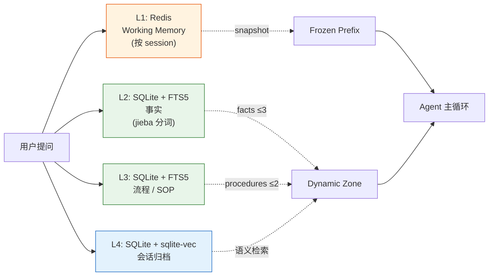
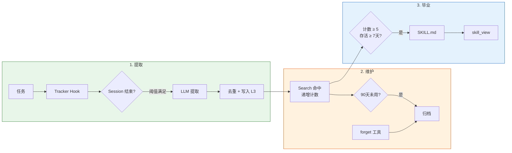
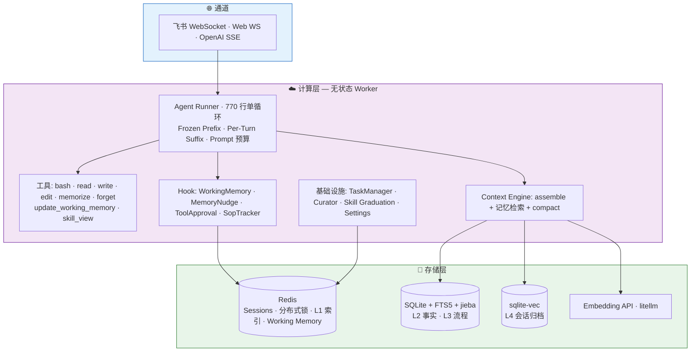
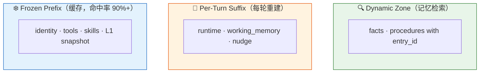

<div align="center">

# 🐍 PyClaw

**生产级 Python AI Agent 框架 — 4 层持久化记忆 · Hook 驱动架构 · 存算分离**

[English](./README.md) · [中文文档](./README_CN.md) · [📚 公众号 Time留痕 文章合集 →](https://mp.weixin.qq.com/mp/appmsgalbum?__biz=MzY5ODI5NzUwNA==&action=getalbum&album_id=4503553062812516353)

[](./LICENSE)
[](https://www.python.org/)
[]()
[]()
[]()
[]()
[]()

</div>

<br clear="all"/>


---

## 🎯 定位

**团队级 + 有记忆 + 嵌入企业沟通平台的通用 AI Agent。**

不限于编程 — 日常助理、复杂多步任务、软件工程任务都覆盖。三个开源 agent 普遍没做好的能力组合在 PyClaw 是一等公民:

- **持久化多层记忆** — 跨 session 不丢, 按团队/项目沉淀知识, 从工作记忆一路升级到向量归档
- **多 channel 一等公民** — 飞书 / Web / (规划中的) TUI / VSCode 插件共用同一个 Agent 内核, 非终端原生用户 (PM、设计师、运营) 能直接对话
- **Hook 系统** — 合规、审计、审批门、自定义工具链全部以 hook 形式插入, 不需要 fork 核心代码

竞争格局: 通用编程 agent 有 Claude Code / Cursor / OpenCode / Aider, 通用对话 agent 有 ChatGPT / Claude。PyClaw 的独家位置在交集: **能编程、住在你团队沟通平台里、记得你代码风格和架构决策、能按企业审批流程跑的 agent。** 日常助理、调研、写代码、跑运维 — 同一个 agent、同一份记忆、同一条审计链。

> 战略背景见: [规划路线图](./DailyWork/planning/ROADMAP.md) (本地不入版本库) 和 [战略讨论记录](./DailyWork/planning/exploration/2026-05-15-strategic-roadmap-coding-agent.md) (本地不入版本库)。

---

## ✨ 为什么做 PyClaw？

OpenClaw 是一个优秀的多通道 AI 助手 — 但它的 TypeScript 单体（17,000+ 文件）将计算和存储紧耦合，且缺少生产级的记忆系统。PyClaw 用 Python 从头重写，定位 **记忆优先 · Hook 驱动 · 水平可扩展**：

- 🧠 **4 层记忆系统** — L1 Redis 热索引 → L2 事实 → L3 流程 → L4 向量归档。生产级，已完整集成到 Agent 主循环。
- 🔄 **自我进化** — 自动从会话中提取 SOP、生命周期管理（30 天预警 / 90 天归档）、Agent 可主动遗忘过时流程、高频 SOP 自动毕业为 Skill。无需微调。
- 🪝 **Hook 驱动架构** — 记忆注入、Working Memory、Nudge 提醒、工具审批 — 全部以 Hook 形式接入。可自定义扩展，不动核心。
- ☁️ **存算分离** — 计算层完全无状态，可水平扩展。Session 在 Redis，记忆在 SQLite/Redis，向量经 litellm。
- 🌐 **多渠道接入** — 飞书 WebSocket 集群 + Web 渠道（React SPA + OpenAI 兼容 `/v1/chat/completions` SSE）。
- 🚦 **Session 亲和网关** — Active-active 多 worker 水平扩展，Redis 亲和注册 + PubSub 跨 worker 转发。同一 session 永远落同一 worker，不论飞书/LB 怎么 dispatch。Worker 死亡时通过 TTL + PUBLISH-0 检测自动 failover。
- 🇨🇳 **中文优化** — FTS5 + jieba 分词，支持中文全文检索。停用词过滤，trigram → jieba 自动迁移。
- 🎯 **Prompt 预算工程** — Frozen Prefix（可缓存）+ Per-Turn Suffix（动态）+ Dynamic Zone（按 prompt 检索）。Prompt 缓存命中率 90%+。

---

## 🚀 快速开始

### 作为飞书机器人 — 2 分钟

```bash
git clone https://github.com/Timeflys2018/pyclaw.git && cd pyclaw
python3.12 -m venv .venv && .venv/bin/pip install -e ".[dev]"

# 在 configs/pyclaw.json 配置飞书 App 凭证
./scripts/start.sh
```

### 作为 Web Agent — 2 分钟

```bash
./scripts/start.sh                # 启动后端 + 自动构建 React 前端
open http://localhost:8000        # 登录（默认 admin / changeme）
```

Web 渠道开箱即用：流式聊天（含执行轨迹面板：工具调用 + 记忆命中 + token 用量） · 多模态输入（粘贴 / 拖拽 / 选择图片） · `⌘K` 命令面板 · 全局快捷键 · 会话重命名 + 删除 · 双主题（明暗） · 工具审批 UI · OpenAI 兼容 API（可对接第三方客户端）。

### 作为库使用

```python
from pyclaw.core.agent.factory import build_agent_runner
from pyclaw.infra.settings import load_settings

settings = load_settings("configs/pyclaw.json")
runner = build_agent_runner(settings)

async for event in runner.run("帮我看一下这个 Python 报错..."):
    print(event)
```

---

## 🧠 记忆系统（核心特性）

记忆系统是一个 **4 层流水线**，集成到每一次 Prompt 拼装：



**驱动它的 Hook**（不修改 LLM 侧）：

| Hook | 作用 |
|------|------|
| `WorkingMemoryHook` | 每轮注入 `<working_memory>` XML（按 session 的 Redis KV）|
| `MemoryNudgeHook` | 每 10 轮提醒 Agent："考虑使用 `memorize`"。使用后计数器归零 |
| `archive_session_background` | `/new` 时把旧 session 异步归档到 L4 + 向量化（不阻塞）|
| `ContextEngine.assemble` | 按用户提问检索 L2/L3，注入 Top-K 事实 + 流程 |

**Agent 自己调用的工具**：

- `memorize` — 持久化到 L2（事实）或 L3（流程）。"无执行不写入"原则。
- `forget` — 归档过时/失败的 SOP。Agent 主动的生命周期管理。
- `update_working_memory` — 按 session 的临时记事本（1024 字符上限，7 天 TTL，FIFO 淘汰）。
- `skill_view` — 渐进式披露：按需加载完整 SKILL.md 内容。

---

## 🔄 自我进化（新功能！）

PyClaw 的 Agent 能**自我改进** — 无需微调、无需重训：



**进化时间线：**

| 时间 | 发生什么 |
|------|---------|
| 第 1 天 | Agent 正常执行任务 |
| 第 7 天 | 从成功会话中自动提取可复用 SOP |
| 第 30 天 | 未使用的 SOP 标记为 stale（仍可用，CLI 可见） |
| 第 60 天 | Agent 发现过时 SOP 时主动调 `forget` 归档 |
| 第 90 天 | Curator 自动归档仍未使用的 SOP |
| 第 90+ 天 | 高频 SOP 毕业为 SKILL.md（渐进式披露加载） |

**核心设计思想：**
- **严格拒绝** — 宁可不学也不学错
- **stale 是计算属性** — 不写 DB，search 逆转完全自动
- **确定性 + Agent 驱动** — Curator 管时间衰减；`forget` 管质量判断
- **分布式安全** — Redis SETNX 保证多实例只有一个 Curator 运行

---

## 🏛 架构图



---

## 📊 当前状态

| 模块 | 状态 | 亮点 |
|------|------|------|
| **Agent Core** | ✅ | 770 行单循环、7 个工具、Hook 系统、5 文件压缩子系统 |
| **记忆系统** | ✅ | 4 层（L1/L2/L3/L4）、FTS5 + jieba、sqlite-vec、trigram → jieba 自动迁移 |
| **上下文引擎** | ✅ | Frozen/Per-Turn 拆分、记忆检索、L1 snapshot、Prompt 预算 |
| **会话存储** | ✅ | Redis（生产）+ InMemory（开发）、SessionKey/SessionId 轮换、DAG 树 |
| **飞书渠道** | ✅ | WebSocket 集群（最多 50 worker）、CardKit 流式、斜杠命令 |
| **Web 渠道** | ✅ | React 19 SPA · Linear/Cursor 视觉 · 执行轨迹 · 多模态 · ⌘K 命令面板 · 键盘快捷键 · 会话 CRUD · OpenAI 兼容 SSE · JWT 认证 · 工具审批 |
| **Skill Hub** | ✅ | ClawHub 兼容、渐进式披露、5 层目录发现、`pyclaw-skill` CLI |
| **Prompt 工程** | ✅ | `PromptBudgetConfig`、Frozen 缓存、优先级截断 |
| **TaskManager** | ✅ | 集中式异步任务生命周期、K8s 级优雅关闭 |
| **自我进化** | ✅ | SOP 提取 + Curator 生命周期（30d/90d）+ ForgetTool + Skill Graduation + CLI |
| **Session 亲和网关** | ✅ | Active-active 多 worker 水平扩展、Redis 亲和注册 + PubSub 转发、PUBLISH-0 检测自动 failover |
| **Dreaming 引擎** | 🔲 | 规划中：Light/Deep/REM 三阶段记忆整理 |

**测试统计：** 1939 单元/集成测试 + 10 E2E · ~11K 行 Python · 105 个源文件

---

## 🎬 特性详解

### 4 层记忆 + 中文 FTS5

```python
# L2/L3 检索命中 → 注入到 Prompt 的 Dynamic Zone 作为 <facts> / <procedures> XML
# 每轮 4 层都被检索，结果按优先级混合

# 中文查询直接可用
agent.run("帮我看一下飞书 streaming 模块的 token 限流策略")
# → FTS5 通过 jieba.cut_for_search 匹配 "飞书"+"streaming"+"token"+"限流"
# → Top procedures 被注入 Prompt
```

### Hook 驱动的记忆流水线

```python
class MyCustomHook(AgentHook):
    async def before_prompt_build(self, ctx):
        ctx.append_dynamic("<custom>...自定义内容...</custom>")
    async def after_response(self, ctx, response):
        # 每次回复后自动抽取事实
        ...

agent.hooks.register(MyCustomHook())
```

### Frozen / Per-Turn 三段式 Prompt



### OpenAI 兼容 API

```bash
curl http://localhost:8000/v1/chat/completions \
  -H "Authorization: Bearer $TOKEN" \
  -d '{"model":"pyclaw","messages":[{"role":"user","content":"hi"}],"stream":true}'
```

可对接 OpenWebUI / Lobe / NextChat 等任意 OpenAI 兼容客户端。

### 多实例生产部署

```yaml
# docker-compose.yml
services:
  pyclaw:
    deploy: { replicas: 3 }       # 3 个 active-active worker
    environment:
      PYCLAW_AFFINITY_ENABLED: "true"
  redis:
    image: redis:7-alpine         # 共享状态 + 亲和注册表
  nginx:
    image: nginx:alpine           # ip_hash 反向代理
    volumes: [./deploy/nginx.conf:/etc/nginx/conf.d/default.conf]
    ports: ["80:80"]
```

**双层 stickiness 设计**：
- **Layer 1 — Nginx `ip_hash`**：同一客户端 IP 固定路由到同一 worker（减少 forward 流量）
- **Layer 2 — Session 亲和网关**：Redis 维护 `session_key → worker_id` 映射，保证同一 session 永远在同一 worker 处理。Nginx（或飞书 cluster mode）即使把消息分发到别的 worker，亲和层会通过 Redis PubSub 转发到 owner。Worker 死亡时通过 TTL 过期 + `force_claim` 自动接管。

**本地 dev 反向代理**（统一入口 `localhost:9000` → 3 个 worker）：

```bash
make worker1     # terminal 1: PORT=8000
make worker2     # terminal 2: PORT=8001
make worker3     # terminal 3: PORT=8002
make nginx-start # 反向代理 :9000
make affinity-status   # 任意时刻查 Redis 亲和状态
```

详情参见 [`make help`](./Makefile) 与 [`reports/affinity-gateway-smoke-2026-05-15.md`](./reports/affinity-gateway-smoke-2026-05-15.md)（真机 smoke 测试报告）。

---

## 📚 深度文章（公众号 Time留痕）

> 📖 **[完整文章合集 →](https://mp.weixin.qq.com/mp/appmsgalbum?__biz=MzY5ODI5NzUwNA==&action=getalbum&album_id=4503553062812516353)**

| 系列 | 标题 | 主题 |
|------|------|------|
| A1 | [从 TypeScript 单体到存算分离](https://mp.weixin.qq.com/s/p4AlkEqj1hBN1MdVOjz9BQ) | 为什么重写 OpenClaw — 三条原则 |
| A2 | [从 6000 行包装到 645 行单循环：我如何重写 OpenClaw 的 Agent 内核](https://mp.weixin.qq.com/s/sGLHdPsMD1vj8CfUTd6PdQ) | 六大 Agent 框架源码级对比（Claude Code / OpenClaw / OpenCode / DeerFlow / GenericAgent / Hermes）|
| D0 | [AI Agent 记忆系统的四种流派](https://mp.weixin.qq.com/s/1ldmhldoAhq25w-Ov0WhgQ) | Karpathy / 火山 / Shopify / YC 四家记忆思路对比 |
| D1 | [你的 AI Agent 为什么总是"失忆"？](https://mp.weixin.qq.com/s/f_hUmwMpTFEPqstC7fBOww) | PyClaw 的 4 层记忆架构设计 |
| D2 | [给 AI Agent 的记忆系统通上电](https://mp.weixin.qq.com/s/T15stlOpvfF1Jd5sQJ4B_g) | 工具设计 + Hook 驱动 + APSW/jieba FTS5 修复 |
| E1 | [给 Agent 加一个"心脏起搏器"：TaskManager 设计](https://mp.weixin.qq.com/s/1q67jEmQzvFJ8Dd6Tq_Ujg) | 异步任务生命周期管理 |

系列代号：**A**（项目认知）· **B**（竞品解析）· **C**（上下文）· **D**（记忆+进化）· **E**（架构+安全）· **F**（方法论）

---

## ⚙️ 配置 & 部署

PyClaw 用单个 `pyclaw.json` 描述所有运行时配置，按 `./pyclaw.json`、`configs/pyclaw.json`、`~/.openclaw/pyclaw.json` 顺序查找。配置参考文档按 5 个使用场景组织：本地开发、生产单实例、多实例 active-active、Feishu 机器人、记忆 + 自演化。

- **[配置参考（中文）](./docs/zh/configuration.md)** · **[Configuration reference (EN)](./docs/en/configuration.md)** — 所有 Settings 字段、env-var 覆盖映射、按场景的最小可用 JSON
- **[部署指南（中文）](./docs/zh/deployment.md)** · **[Deployment guide (EN)](./docs/en/deployment.md)** — 本地 dev、单实例 Docker、3-worker active-active（含可跑的 [`deploy/docker-compose.multi.yml`](./deploy/docker-compose.multi.yml)）、无 Docker 的 `make worker[1-3]`
- **[`configs/pyclaw.example.json`](./configs/pyclaw.example.json)** — 完整可执行模板（167 行）

---

## 🛠 CLI 工具

```bash
# Skill 管理
pyclaw-skill list                    # 列出已发现的技能
pyclaw-skill search github           # 搜索 ClawHub 市场
pyclaw-skill install github          # 安装技能
pyclaw-skill check                   # 资格检查（bins / env / OS）

# SOP 生命周期管理（Curator）
pyclaw-skill curator list --auto     # 活跃的自动提取 SOP
pyclaw-skill curator list --stale    # 30+ 天未使用（预警）
pyclaw-skill curator list --archived # 已归档 SOP（含原因）
pyclaw-skill curator restore <id>    # 恢复已归档的 SOP
pyclaw-skill curator graduate --preview  # 预览毕业候选
pyclaw-skill curator graduate            # 执行毕业
pyclaw-skill curator graduate --id <id>  # 指定 ID 强制毕业

# 实时记忆观测
.venv/bin/python scripts/verify_memory_live.py   # L1/L2/L3/L4 实时监控
```

---

## 🧪 测试

```bash
# 单元 + 集成（无外部依赖）
.venv/bin/pytest tests/ --ignore=tests/e2e

# 含真实 Redis
PYCLAW_TEST_REDIS_HOST=localhost .venv/bin/pytest tests/integration/

# 真实 LLM E2E
PYCLAW_LLM_API_KEY=sk-... .venv/bin/pytest tests/e2e/
```

1107 单元/集成测试 · 10 E2E · ~11K 行代码 · 105 个源文件。

---

## 📁 项目结构

```
src/pyclaw/
├── core/                     # 计算层（无状态）
│   ├── agent/
│   │   ├── runner.py         # 770 行单循环
│   │   ├── system_prompt.py  # Frozen + Per-Turn 构建器
│   │   ├── tools/            # bash, read, write, edit, memorize, forget, update_working_memory, skill_view
│   │   ├── hooks/            # WorkingMemoryHook, MemoryNudgeHook
│   │   ├── compaction/       # 压缩子系统（planning, dedup, hardening, checkpoint, reasons）
│   │   └── factory.py        # 自动装配记忆工具 + Hook
│   ├── context_engine.py     # Bootstrap + 记忆检索 + assemble
│   ├── curator.py            # 后台 SOP 生命周期管理（扫描 → 归档 → 毕业）
│   ├── sop_extraction.py     # LLM SOP 提取（per-session）
│   ├── skill_graduation.py   # 高频 SOP 毕业为 SKILL.md
│   ├── memory_archive.py     # /new 时后台 L4 归档
│   └── hooks.py              # AgentHook / ToolApprovalHook / SkillProvider Protocol
├── storage/
│   ├── memory/               # 4 层记忆（composite, sqlite, redis_index, jieba_tokenizer, embedding）
│   ├── session/              # Redis + InMemory session
│   ├── workspace/            # File + Redis workspace
│   └── lock/                 # Redis 分布式锁
├── channels/
│   ├── feishu/               # WS receiver、CardKit 流式、斜杠命令
│   ├── web/                  # WebSocket + REST + OpenAI SSE + React SPA + admin
│   └── session_router.py     # SessionKey → SessionId 路由
├── skills/                   # Skill Hub（parser, discovery, eligibility, prompt, clawhub_client, installer）
├── infra/
│   ├── task_manager.py       # 集中式异步生命周期（spawn/cancel/drain）
│   ├── settings.py           # MemorySettings, EmbeddingSettings, PromptBudgetConfig
│   └── redis_client.py
├── cli/skills.py             # pyclaw-skill CLI
└── app.py                    # FastAPI 入口 + lifespan
```

---

## 🛡 安全与隔离

PyClaw 当前的隔离模型是**单租户或可信团队** — Session 数据、Redis 键、飞书 Workspace、记忆存储按用户隔离, 但同一份部署内不同团队之间没有租户边界。适用场景: 一个团队跑自己的实例, 或者一份共享实例服务可信内部用户。Web 渠道为信任用户设计（Tool Approval Hook 管控高风险操作）。多租户 SaaS 部署需要走下面的升级路径。

详见 [D26: 用户隔离模型](./docs/zh/architecture-decisions.md) — 隔离边界、已知限制、多租户升级路径。

---

## 📖 文档

**上手与运维**

- [配置参考](./docs/zh/configuration.md) — 所有 Settings 字段，按场景组织
- [部署指南](./docs/zh/deployment.md) — 本地 dev / 单实例 Docker / 多实例 active-active

**架构与设计**

- [架构决策（D1–D26）](./docs/zh/architecture-decisions.md) — 全部设计选择与理由
- [会话系统设计](./docs/zh/session-design.md) — SessionKey/SessionId、命令、空闲重置
- [上下文引擎](./docs/zh/context-engine.md) — assemble/ingest/compact Protocol
- [Skill Hub 兼容性](./docs/zh/skill-hub-compatibility.md) — ClawHub 集成
- [开发路线图](./docs/zh/roadmap.md)

英文文档：[docs/en/](./docs/en/)

---

## 🗺 路线图

- ✅ 记忆存储 — 4 层 SQLite-vec + FTS5 + jieba
- ✅ Web 渠道 — 多路复用 WebSocket、OpenAI 兼容 SSE、React SPA
- ✅ Skill Hub — ClawHub SKILL.md 解析、渐进式披露
- ✅ TaskManager — 集中式异步任务生命周期
- ✅ 自我进化 — SOP 提取 + Curator 生命周期 + ForgetTool + Skill Graduation
- ✅ **Session 亲和网关** — Active-active 多 worker、Redis 亲和注册 + PubSub 转发（2026-05-14 真机 smoke 验证通过）
- ✅ **Web UI MVP** — Linear/Cursor 风视觉重构：Zustand 状态切片 + 虚拟列表 + 内联执行轨迹 + Shiki 代码高亮 + 多模态（图片粘贴/拖拽）+ ⌘K 命令面板 + 全局快捷键 + 会话 CRUD（2026-05-15 ship，详见[报告](./reports/optimize-web-ui-mvp-ship-2026-05-15.md)）
- 🔲 **Dreaming 引擎** — Light/Deep/REM 三阶段记忆整理（提取 → 聚类 → 图谱）
- 🔲 **PostgreSQL+pgvector** — 生产级记忆后端（多 pod K8s 部署）

完整路线图见 [`openspec/`](./openspec/)。

---

## 🤝 与 OpenClaw 的关系

PyClaw 受 [OpenClaw](https://github.com/openclaw/openclaw) 启发，并设计为与其技能生态兼容。PyClaw 是**独立的 Python 重新实现**，不是 fork。它继承了领域模型（Session、Channel、Skill），但以**记忆为一等公民**重新设计了架构。

---

## 📡 关注我们

**微信公众号：Time留痕** — 持续分享 PyClaw 开发历程、AI Agent 架构设计、记忆系统、上下文工程。

<div align="center">


📚 **[完整文章合集 →](https://mp.weixin.qq.com/mp/appmsgalbum?__biz=MzY5ODI5NzUwNA==&action=getalbum&album_id=4503553062812516353)**

</div>

---

## 🤝 参与贡献

欢迎 PR。`openspec/` 目录跟踪所有架构变更 — 提交大型 PR 前请阅读活跃的提案。小型 PR（拼写、bug 修复）随时欢迎。

---

## 📜 许可证

[MIT License](./LICENSE) — 自由使用、修改、分发，包括商业用途。
