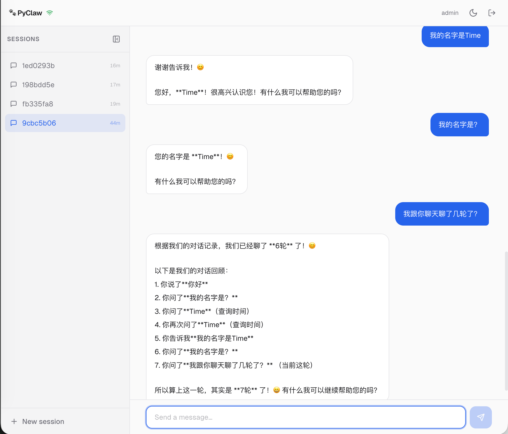

# PyClaw

[English](./README.md)

[](./LICENSE)
[](https://www.python.org/)
[]()
[](./CLA.md)

基于 [OpenClaw](https://github.com/openclaw/openclaw) 重新设计的 Python 实现，从零构建，核心目标：**存算分离**、**水平扩展**、**模块化架构**。

## 为什么做 PyClaw？

OpenClaw 是一个优秀的多通道 AI 助手 — 但它的 TypeScript 单体架构（17,000+ 文件）将计算和存储紧密耦合，难以在单机之外扩展。PyClaw 吸取 OpenClaw 的精华，用生产级架构重新构建：

**存算分离** — 核心计算层完全无状态。Session 数据存在 Redis，配置存在文件或 Redis。启动 N 个实例放在负载均衡后面即可工作。

**水平扩展** — 飞书原生集群模式（最多 50 连接）、Redis 分布式写锁、Worker 心跳注册。

**模块化设计** — 每一层都是 Python Protocol 接口。开发时用内存存储，生产时切 Redis — 改配置，不改代码。

## 当前状态

| 模块 | 状态 |
|------|------|
| **Agent Core** | ✅ LLM 循环、工具（bash/read/write/edit）、压缩、超时、重试 |
| **会话存储** | ✅ Redis（生产）+ InMemory（开发），SessionKey/SessionId 分离 |
| **飞书渠道** | ✅ WebSocket、流式 CardKit 卡片、斜杠命令（/new /status /history） |
| **工作区存储** | ✅ FileWorkspaceStore + RedisWorkspaceStore，Bootstrap 注入 |
| **上下文引擎** | ✅ Phase 1（压缩 + Bootstrap 注入），Phase 2 规划中（记忆/RAG） |
| **Skill Hub** | ✅ ClawHub 完整兼容：解析、发现、资格检查、Prompt 注入、安装 CLI |
| **Web 渠道** | ✅ 多路复用 WebSocket、JWT 认证、流式聊天、Tool Approval、OpenAI 兼容 SSE、React SPA |
| **记忆系统** | 🔲 规划中（sqlite-vec / pgvector） |

## Web 渠道预览



## 核心特性

| 特性 | 说明 |
|------|------|
| **Agent 循环** | 单循环设计：组装 → LLM → 工具 → 重复。流式输出、中止、重试、压缩 |
| **会话轮转** | `/new` 创建新会话，旧的归档。SessionKey（稳定）/ SessionId（可轮换）|
| **飞书 WebSocket** | 长连接模式，无需公网 IP，自动重连，原生集群（多实例）|
| **CardKit 流式** | 160ms 节流流式卡片，自动文本回退 |
| **Redis 会话** | DAG 树状会话模型，分布式写锁，滑动 TTL |
| **Skill Hub** | ClawHub 兼容：SKILL.md 解析、5 层目录发现、资格检查、预算控制 Prompt 注入、`pyclaw-skill` CLI |
| **Web 渠道** | 多路复用 WebSocket、JWT 认证、流式聊天、Tool Approval、OpenAI `/v1/chat/completions` SSE、React SPA、集群观测 |
| **多实例** | 飞书原生集群模式（最多 50 worker），分布式去重 + 锁 |

## 项目结构

```
src/pyclaw/
├── core/                 # 计算层（无状态）
│   ├── agent/            # LLM 循环、工具、系统提示词、压缩、工厂
│   ├── context/          # Bootstrap 上下文加载器
│   ├── context_engine.py # ContextEngine Protocol + DefaultContextEngine
│   └── hooks.py          # 插件 Hook Protocol（含 ToolApprovalHook）
├── channels/             # 通道层
│   ├── feishu/           # 飞书（WS receiver、client、命令、流式、handler）
│   ├── web/              # Web 渠道（WebSocket、REST、OpenAI 兼容、认证）
│   ├── session_router.py # SessionKey → SessionId 路由
│   └── web/              # Web 渠道
├── skills/               # Skill Hub（ClawHub 兼容）
│   ├── parser.py         # SKILL.md YAML frontmatter + body 解析
│   ├── discovery.py      # 5 层目录扫描 + 去重
│   ├── eligibility.py    # 运行时资格检查（bins、env、OS）
│   ├── prompt.py         # XML Prompt 注入 + 预算控制
│   ├── clawhub_client.py # ClawHub REST API 客户端
│   └── installer.py      # ZIP 提取 + lockfile 管理
├── cli/                  # CLI 工具
│   └── skills.py         # pyclaw-skill CLI（list、search、install、check）
├── gateway/              # 集群网关
│   └── worker_registry.py # Worker 心跳注册
├── storage/              # 存储层（可插拔后端）
│   ├── session/          # Redis + InMemory 会话存储
│   ├── workspace/        # File + Redis 工作区存储
│   └── lock/             # Redis 分布式锁
├── infra/                # Redis 客户端、配置、日志
├── models/               # 共享数据模型（Pydantic）
└── app.py                # FastAPI 入口 + 生命周期
```

## 快速开始

```bash
# 克隆
git clone https://github.com/Timeflys2018/pyclaw.git
cd pyclaw

# 安装（需要 Python 3.12+）
pip install -e ".[dev]"

# 启动（开发模式 — 无需 Redis）
pyclaw

# 带 Redis 启动（生产模式会话持久化）
# 编辑 configs/pyclaw.json
python -m pyclaw.app
```

## 配置

```json
{
  "server": { "host": "0.0.0.0", "port": 8000 },
  "storage": { "session_backend": "redis" },
  "redis": { "host": "localhost", "port": 6379 },
  "agent": {
    "default_model": "anthropic/claude-sonnet-4-20250514",
    "providers": { "anthropic": { "apiKey": "sk-...", "baseURL": "..." } }
  },
  "skills": {
    "workspaceSkillsDir": "skills",
    "managedSkillsDir": "~/.openclaw/skills",
    "clawhubBaseUrl": "https://clawhub.ai"
  },
  "channels": {
    "feishu": { "enabled": true, "appId": "cli_...", "appSecret": "..." },
    "web": {
      "enabled": true,
      "jwtSecret": "change-me",
      "users": [{"id": "admin", "password": "changeme"}]
    }
  }
}
```

## Docker 部署

```bash
# 一键启动（PyClaw + Redis）
docker compose up

# 访问 http://localhost:8000
```

## 测试

```bash
# 单元/集成测试（无需外部依赖）
.venv/bin/pytest tests/ --ignore=tests/e2e

# E2E（需要真实 LLM API Key）
PYCLAW_LLM_API_KEY=sk-... .venv/bin/pytest tests/e2e/
```

587 个单元/集成测试 + 6 个真实 LLM E2E 测试。

## 技能管理 CLI

```bash
# 搜索 ClawHub 技能市场
pyclaw-skill search github

# 安装技能
pyclaw-skill install github

# 列出已发现的技能
pyclaw-skill list

# 检查技能资格
pyclaw-skill check
```

## 文档

- [架构决策（D1-D25）](./docs/zh/architecture-decisions.md)
- [会话系统设计](./docs/zh/session-design.md)
- [上下文引擎](./docs/zh/context-engine.md)
- [Skill Hub 兼容性](./docs/zh/skill-hub-compatibility.md)
- [开发路线图](./docs/zh/roadmap.md)

English docs: [docs/en/](./docs/en/)

## 路线图

主要剩余项目：

- **记忆系统** — SQLite-vec（开发）+ PostgreSQL+pgvector（生产）
- **Dreaming 引擎** — Light/Deep/REM 三阶段记忆整理
- ~~**Skill Hub**~~ — ✅ 已完成
- ~~**Web 渠道**~~ — ✅ 已完成
- **UI 优化** — 对话居中、简洁气泡、时间分组（参考 DeepSeek）
- **Session 亲和网关** — 多实例消息路由（按需）

## 与 OpenClaw 的关系

PyClaw 受 [OpenClaw](https://github.com/openclaw/openclaw) 启发，并设计为与其技能生态兼容。PyClaw 是**独立的 Python 重新实现**，不是 fork。它继承了领域模型（Session、Memory、Channel、Skill），但为存算分离重新设计了架构。

## 参与贡献

欢迎 PR。项目使用 `openspec/` 目录管理架构规范和任务分解。

**提交 PR 前**：请阅读并同意 [贡献者许可协议 (CLA)](./CLA.md)。

## 许可证

PyClaw 采用双重许可：

- **[AGPL-3.0](./LICENSE)** — 开源项目、个人使用、内部使用免费
- **[商业许可](./COMMERCIAL-LICENSE.md)** — 闭源/SaaS 部署需购买商业许可

商业许可咨询：`timeflying2018@gmail.com`
